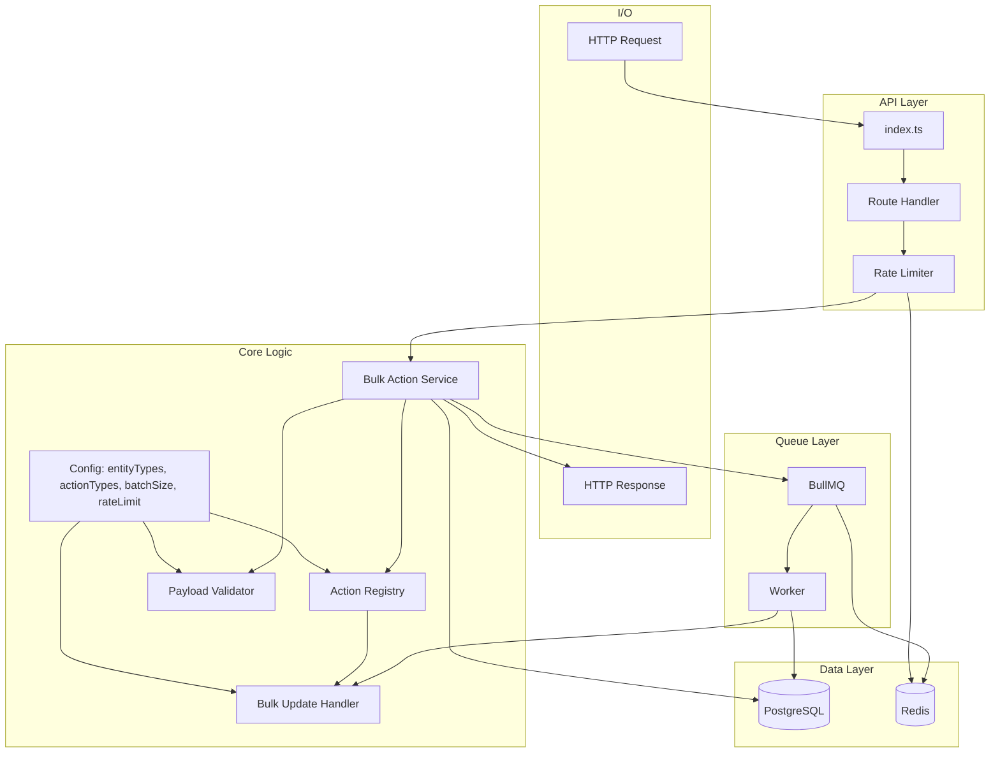
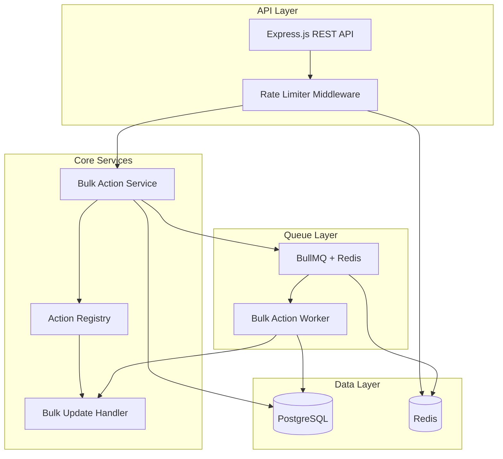
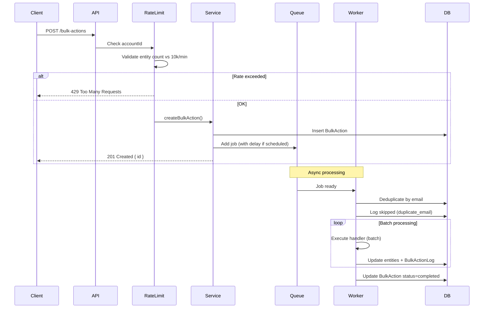
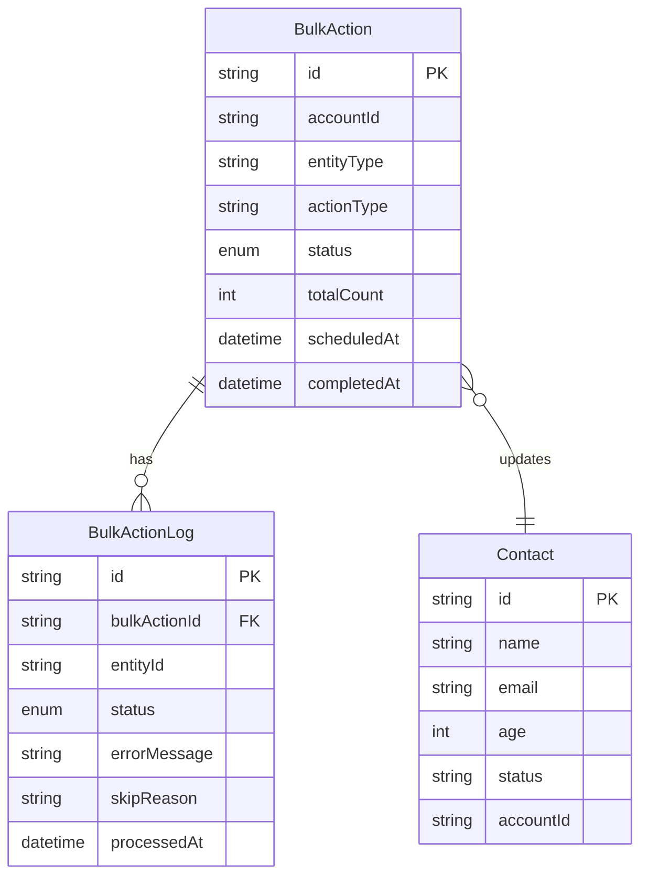
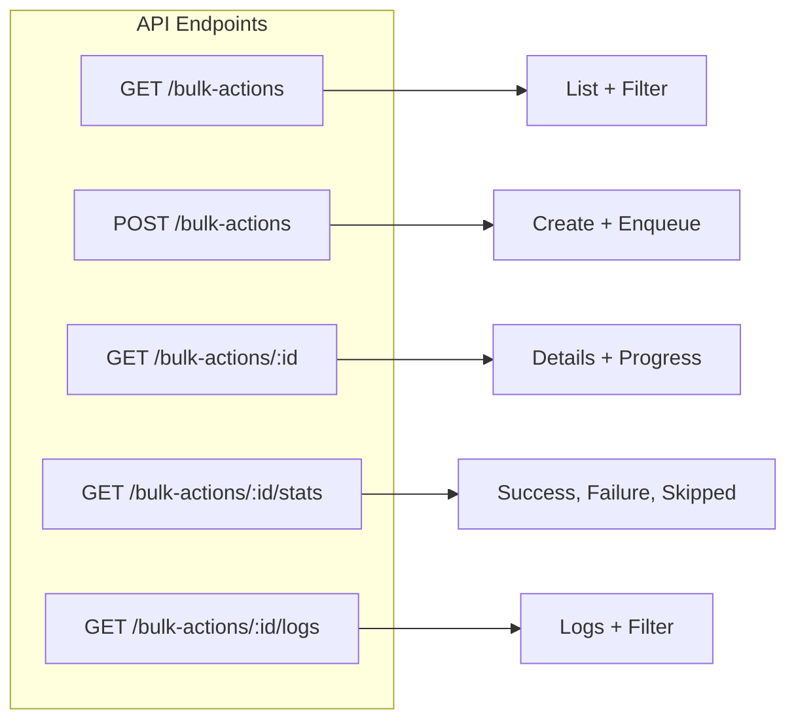
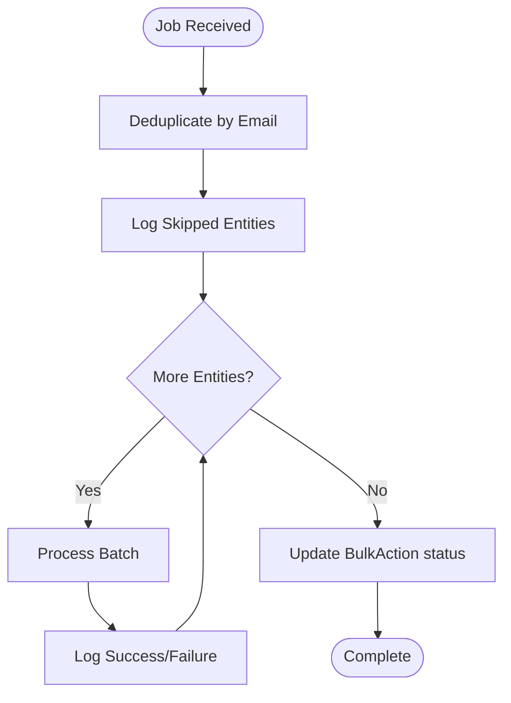

# Bulk Action Platform - Architecture

## Overview

The Bulk Action Platform is designed for high scalability, extensibility, and robust error handling. It processes bulk operations on CRM entities (currently Contact) using a queue-based architecture.

**Note:** This document contains both text-based (ASCII) diagrams and Mermaid diagrams. ASCII diagrams are visible in all text viewers. Mermaid diagrams render in:
- GitHub (automatically)
- VS Code (with Mermaid extension)
- [mermaid.live](https://mermaid.live) (copy/paste code blocks)
- Most modern markdown viewers

---

## Proposed Architecture

**Note:** Mermaid diagrams below require a viewer that supports Mermaid (GitHub, VS Code with Mermaid extension, or [mermaid.live](https://mermaid.live)). See ASCII diagrams below for text-only view.

### Visual Diagram (Mermaid)



### Text Diagram (ASCII)

```
┌─────────────────────────────────────────────────────────────────┐
│                         API Layer                                │
├─────────────────────────────────────────────────────────────────┤
│  HTTP Request → index.ts → Route Handler → Rate Limiter        │
└─────────────────────────────────────────────────────────────────┘
                              │
                              ▼
┌─────────────────────────────────────────────────────────────────┐
│                        Core Logic                                │
├─────────────────────────────────────────────────────────────────┤
│                                                                  │
│  ┌──────────────────────────────────────────────────────────┐  │
│  │ Config: entityTypes, actionTypes, batchSize, rateLimit    │  │
│  └──────┬──────────────┬──────────────┬─────────────────────┘  │
│         │              │              │                         │
│         ▼              ▼              ▼                         │
│  ┌─────────────┐ ┌─────────────┐ ┌──────────────────────┐     │
│  │   Action    │ │  Payload    │ │   Bulk Update        │     │
│  │  Registry   │ │  Validator  │ │   Handler            │     │
│  └─────────────┘ └─────────────┘ └──────────────────────┘     │
│         ▲              ▲              ▲                         │
│         └──────────────┴──────────────┘                         │
│                    │                                             │
│                    ▼                                             │
│         ┌──────────────────────┐                                 │
│         │ Bulk Action Service  │                                 │
│         └──────────────────────┘                                 │
└─────────────────────────────────────────────────────────────────┘
                              │
                    ┌─────────┴─────────┐
                    ▼                   ▼
┌──────────────────────────┐  ┌──────────────────────┐
│      Queue Layer         │  │     Data Layer       │
├──────────────────────────┤  ├──────────────────────┤
│ BullMQ ──────► Worker    │  │ PostgreSQL           │
│                          │  │ Redis                │
└──────────────────────────┘  └──────────────────────┘
                    │                   │
                    └─────────┬─────────┘
                              ▼
                    ┌──────────────────┐
                    │  HTTP Response   │
                    └──────────────────┘
```

---

## System Architecture (Component Diagram)



---

## Request Flow

### Text Flow (Step-by-Step)

```
┌─────────┐
│ Client  │
└────┬────┘
     │ POST /bulk-actions
     ▼
┌─────────┐
│   API   │ (index.ts → Routes)
└────┬────┘
     │
     ▼
┌─────────────┐
│ Rate Limiter│ Check accountId (10k entities/min)
└────┬────────┘
     │
     ├─ Rate Exceeded? ──► 429 Response
     │
     └─ OK ──►
              ▼
         ┌──────────────┐
         │   Service    │ createBulkAction()
         └──────┬───────┘
                 │
                 ├─► Insert BulkAction (PostgreSQL)
                 │
                 └─► Enqueue Job (BullMQ + Redis)
                     │
                     └─► 201 Created { id } ──► Client

┌─────────────────────────────────────────────┐
│         Async Processing (Worker)            │
├─────────────────────────────────────────────┤
│                                              │
│  BullMQ ──► Worker receives job             │
│              │                                │
│              ├─► Deduplicate by email        │
│              │                                │
│              ├─► Log skipped (duplicate_email)│
│              │                                │
│              └─► Process in batches (100)     │
│                  │                            │
│                  ├─► Execute handler          │
│                  ├─► Update entities          │
│                  └─► Log to BulkActionLog     │
│                                              │
│  Update BulkAction status = completed        │
└─────────────────────────────────────────────┘
```

### Visual Diagram (Mermaid)


---

## Data Model

### Text Diagram (Entity Relationships)

```
┌─────────────────────────────────┐
│         BulkAction              │
├─────────────────────────────────┤
│ id (PK)                         │
│ accountId                        │
│ entityType                       │
│ actionType                       │
│ status (queued/processing/       │
│          completed/failed)       │
│ totalCount                       │
│ scheduledAt                      │
│ completedAt                      │
└──────────┬──────────────────────┘
           │
           │ 1:N
           │
           ▼
┌─────────────────────────────────┐
│      BulkActionLog               │
├─────────────────────────────────┤
│ id (PK)                         │
│ bulkActionId (FK) ───────────┐   │
│ entityId                     │   │
│ status (success/failure/     │   │
│          skipped)            │   │
│ errorMessage                  │   │
│ skipReason                    │   │
│ processedAt                   │   │
└──────────────────────────────┘   │
                                    │
┌─────────────────────────────────┐ │
│         Contact                 │ │
├─────────────────────────────────┤ │
│ id (PK)                         │ │
│ name                            │ │
│ email                           │ │
│ age                             │ │
│ status                          │ │
│ accountId                       │ │
└─────────────────────────────────┘ │
                                    │
BulkAction updates Contact entities │
(via entityId references)           │
```

### Visual Diagram (Mermaid)


---

## API Endpoints (Flowchart)



---

## Worker Processing Flow



---

## Data Flow

1. **Create**: Client POSTs to `/bulk-actions` with entityIds, payload, and optional scheduledAt
2. **Validate**: Handler validates payload; rate limit checked per accountId
3. **Enqueue**: BulkAction record created; job added to BullMQ (with delay if scheduled)
4. **Process**: Worker picks up job, deduplicates by email, processes in batches
5. **Log**: Each entity result (success/failure/skipped) written to BulkActionLog
6. **Complete**: BulkAction status updated to completed/failed

## Extensibility

### Adding a New Entity (e.g., Company)

1. Add Prisma model for Company
2. Create `src/actions/bulk-update-company/handler.ts` implementing `IBulkActionHandler`
3. Register handler in `src/actions/index.ts`
4. No changes to queue, API routes, or BulkAction table

### Adding a New Action Type (e.g., bulk-delete)

1. Create `src/actions/bulk-delete/handler.ts`
2. Implement `IBulkActionHandler` with `validate()` and `execute()`
3. Register handler
4. API accepts `actionType: "bulk-delete"` automatically

## Scalability

- **Horizontal scaling**: Run multiple worker processes; BullMQ distributes jobs
- **Batch processing**: Configurable batch size (default 100) reduces DB round-trips
- **Indexes**: `(accountId, entityType)`, `(bulkActionId, status)` for fast queries
- **Rate limiting**: Redis sliding window prevents account overload

## Optional Enhancements Implemented

| Feature | Implementation |
|---------|----------------|
| Rate limiting | Redis counter, 10k entities/min per accountId |
| De-duplication | Group by email before processing; first kept, rest skipped |
| Scheduling | BullMQ `job.opts.delay` from scheduledAt |

## Loom Video Outline

1. Architecture overview (this diagram)
2. Demo: Create bulk action via Postman
3. Show worker processing, logs, stats
4. Extensibility: How to add new action/entity
